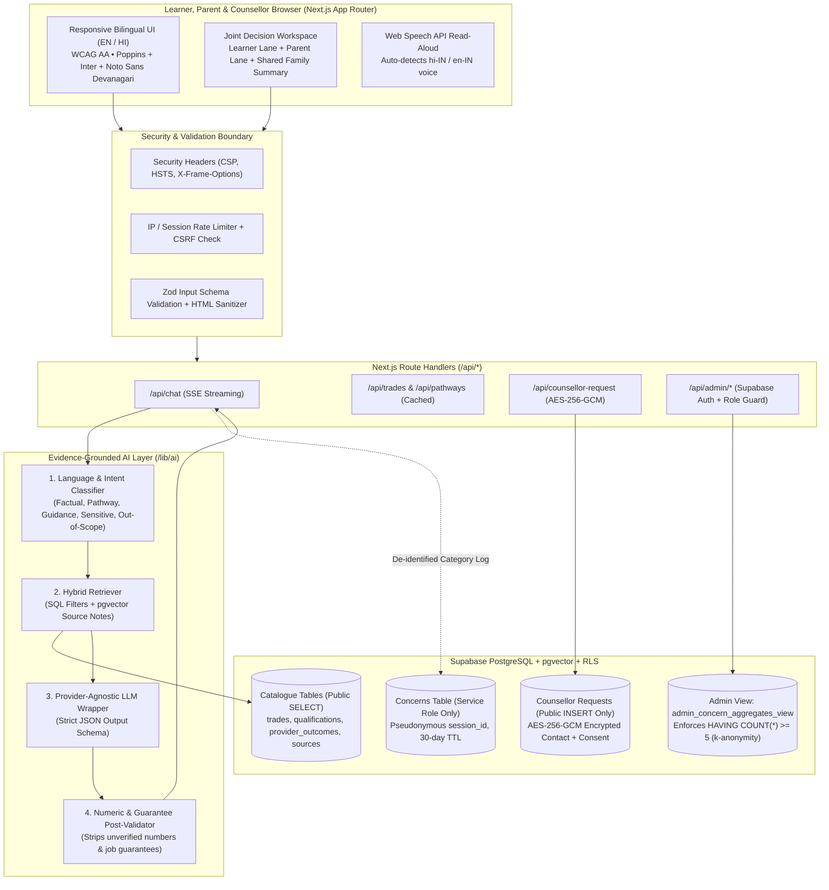

# Margdarshak (SIH26241) System Architecture & AI Pipeline

## 1. High-Level System Architecture

```mermaid
flowchart TB
  subgraph Client["Learner, Parent & Counsellor Browser (Next.js App Router)"]
    UI["Responsive Bilingual UI (EN / HI)<br/>WCAG AA • Poppins + Inter + Noto Sans Devanagari"]
    JointUI["Joint Decision Workspace<br/>Learner Lane + Parent Lane + Shared Family Summary"]
    TTS["Web Speech API Read-Aloud<br/>Auto-detects hi-IN / en-IN voice"]
  end

  subgraph Edge["Security & Validation Boundary"]
    Headers["Security Headers (CSP, HSTS, X-Frame-Options)"]
    RateLimit["IP / Session Rate Limiter + CSRF Check"]
    ZodVal["Zod Input Schema Validation + HTML Sanitizer"]
  end

  subgraph Backend["Next.js Route Handlers (/api/*)"]
    ChatAPI["/api/chat (SSE Streaming)"]
    CatalogueAPI["/api/trades & /api/pathways (Cached)"]
    EscalateAPI["/api/counsellor-request (AES-256-GCM)"]
    AdminAPI["/api/admin/* (Supabase Auth + Role Guard)"]
  end

  subgraph AIPipeline["Evidence-Grounded AI Layer (/lib/ai)"]
    Classifier["1. Language & Intent Classifier<br/>(Factual, Pathway, Guidance, Sensitive, Out-of-Scope)"]
    Retriever["2. Hybrid Retriever<br/>(SQL Filters + pgvector Source Notes)"]
    LLM["3. Provider-Agnostic LLM Wrapper<br/>(Strict JSON Output Schema)"]
    PostValidator["4. Numeric & Guarantee Post-Validator<br/>(Strips unverified numbers & job guarantees)"]
  end

  subgraph Database["Supabase PostgreSQL + pgvector + RLS"]
    CatTables[("Catalogue Tables (Public SELECT)<br/>trades, qualifications, provider_outcomes, sources")]
    ConcernTable[("Concerns Table (Service Role Only)<br/>Pseudonymous session_id, 30-day TTL")]
    CallbackTable[("Counsellor Requests (Public INSERT Only)<br/>AES-256-GCM Encrypted Contact + Consent")]
    AdminView[("Admin View: admin_concern_aggregates_view<br/>Enforces HAVING COUNT(*) >= 5 (k-anonymity)")]
  end

  UI --> Edge --> Backend
  JointUI --> Edge
  ChatAPI --> Classifier --> Retriever
  Retriever --> CatTables
  Retriever --> LLM --> PostValidator
  PostValidator --> ChatAPI
  ChatAPI -. "De-identified Category Log" .-> ConcernTable
  EscalateAPI --> CallbackTable
  AdminAPI --> AdminView
```
