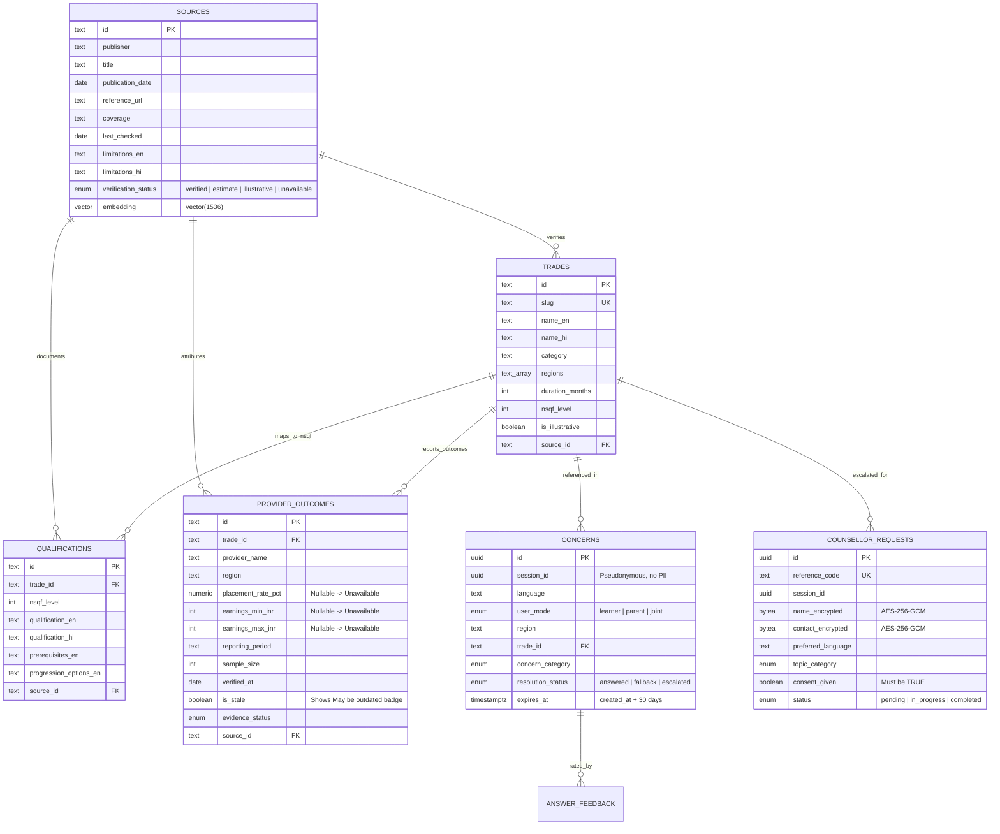

# Margdarshak (SIH26241) Entity-Relationship Diagram

```mermaid
erDiagram
    SOURCES ||--o{ TRADES : "verifies"
    SOURCES ||--o{ QUALIFICATIONS : "documents"
    SOURCES ||--o{ PROVIDER_OUTCOMES : "attributes"
    TRADES ||--o{ QUALIFICATIONS : "maps_to_nsqf"
    TRADES ||--o{ PROVIDER_OUTCOMES : "reports_outcomes"
    TRADES ||--o{ CONCERNS : "referenced_in"
    TRADES ||--o{ COUNSELLOR_REQUESTS : "escalated_for"
    CONCERNS ||--o{ ANSWER_FEEDBACK : "rated_by"

    SOURCES {
        text id PK
        text publisher
        text title
        date publication_date
        text reference_url
        text coverage
        date last_checked
        text limitations_en
        text limitations_hi
        enum verification_status "verified | estimate | illustrative | unavailable"
        vector embedding "vector(1536)"
    }

    TRADES {
        text id PK
        text slug UK
        text name_en
        text name_hi
        text category
        text_array regions
        int duration_months
        int nsqf_level
        boolean is_illustrative
        text source_id FK
    }

    QUALIFICATIONS {
        text id PK
        text trade_id FK
        int nsqf_level
        text qualification_en
        text qualification_hi
        text prerequisites_en
        text progression_options_en
        text source_id FK
    }

    PROVIDER_OUTCOMES {
        text id PK
        text trade_id FK
        text provider_name
        text region
        numeric placement_rate_pct "Nullable -> Unavailable"
        int earnings_min_inr "Nullable -> Unavailable"
        int earnings_max_inr "Nullable -> Unavailable"
        text reporting_period
        int sample_size
        date verified_at
        boolean is_stale "Shows May be outdated badge"
        enum evidence_status
        text source_id FK
    }

    CONCERNS {
        uuid id PK
        uuid session_id "Pseudonymous, no PII"
        text language
        enum user_mode "learner | parent | joint"
        text region
        text trade_id FK
        enum concern_category
        enum resolution_status "answered | fallback | escalated"
        timestamptz expires_at "created_at + 30 days"
    }

    COUNSELLOR_REQUESTS {
        uuid id PK
        text reference_code UK
        uuid session_id
        bytea name_encrypted "AES-256-GCM"
        bytea contact_encrypted "AES-256-GCM"
        text preferred_language
        enum topic_category
        boolean consent_given "Must be TRUE"
        enum status "pending | in_progress | completed"
    }
```
